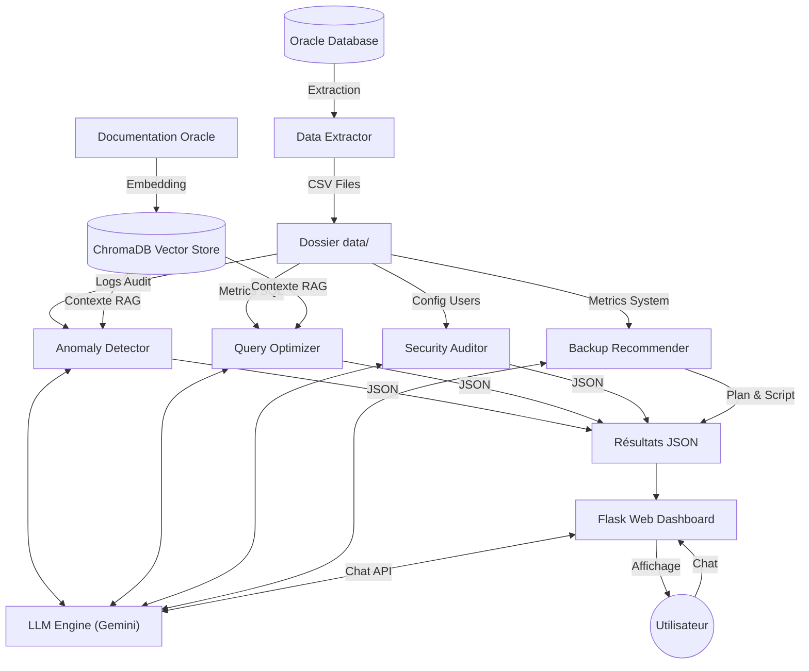

# Architecture du Système

Ce document décrit l'architecture technique de la **Plateforme Intelligente de Gestion Oracle avec IA**.

## Vue d'Ensemble

Le système est conçu comme une suite d'outils modulaires orchestrés autour d'un pipeline de données centralisé (`data/`). Il combine l'extraction de métriques Oracle, leur analyse via des modèles de langage (LLM) enrichis par une base de connaissances (RAG), et une restitution via une interface Web.

## Diagramme de Flux de Données

## Description des Modules

### 1. Module d'Extraction (`src/real_data_extractor.py`)

- **Rôle** : Se connecte à la base Oracle via `python-oracledb` (Thin mode).
- **Entrées** : Connexion SQL (SYSDBA).
- **Sorties** : Fichiers CSV normalisés dans `datav1/` (audit_logs.csv, performance_metrics.csv, etc.).
- **Fonctionnalité** : Exécute des requêtes SQL standard (V$views, DBA_views) pour récupérer l'état réel du système.

### 2. Moteur IA & RAG (`src/llm_engine.py`, `src/rag_setup.py`)

- **LLM Engine** : Interface vers l'API Gemini (Google Generative AI) pour l'analyse générative. Gère les prompts et le contexte système.
- **RAG (Retrieval-Augmented Generation)** : Utilise `ChromaDB` pour indexer et rechercher des documents techniques Oracle pertinents pour enrichir les prompts du LLM.

### 3. Agents d'Analyse

Chaque agent est spécialisé dans un domaine :

- **AnomalyDetector** (`src/anomaly_detector.py`) : Analyse les logs d'accès (AUD$) pour détecter des comportements suspects (ex: accès hors heures, injection SQL).
- **QueryOptimizer** (`src/query_optimizer.py`) : Analyse les requêtes lentes (V$SQL) et leur plan d'exécution pour suggérer des index ou réécritures.
- **SecurityAuditor** (`src/security_audit.py`) : Vérifie les configurations utilisateurs et privilèges (DBA_USERS, DBA_ROLES) contre les bonnes pratiques.
- **BackupRecommender** (`src/backup_recommender.py`) : Suggère une stratégie de sauvegarde (RMAN) basée sur la volumétrie et la criticité.

### 4. Interface Web (`src/webapp/app.py`)

- **Technologie** : Flask (Python).
- **Fonctionnalités** :
  - Dashboard récapitulatif (Scores sécurité, Alertes).
  - Vues détaillées pour chaque module.
  - **Chatbot DBA** : Assistant conversationnel avec mémoire contextuelle, capable de répondre aux questions sur l'état du système en utilisant le contexte RAG et les données live.

## Structure des Données (`data/`)

Le dossier `data/` sert d'échangeur de données :

- `*.csv` : Données brutes de la base de données.
- `*.json` : Résultats d'analyse générés par les agents IA.
- `chroma_db/` : Persistance de la base vectorielle.
