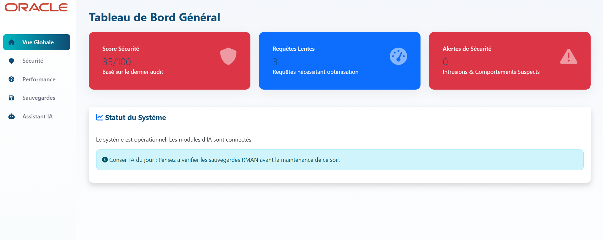
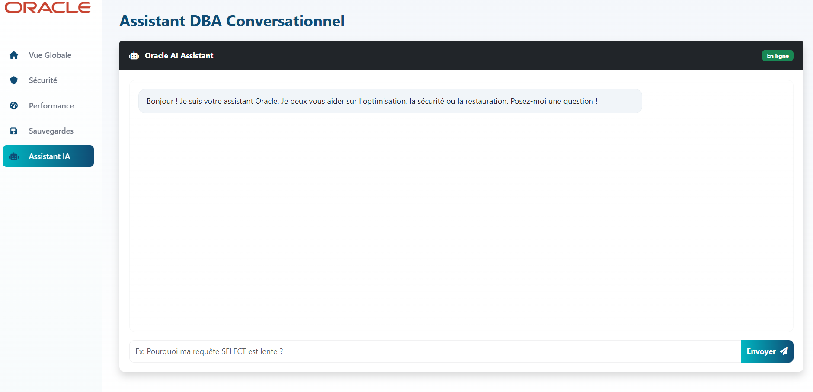

# 🛡️ Oracle Intelligent DBA Platform (AI-Powered)


> *Une plateforme d'administration de base de données autonome (Autonomous DBA) capable d'auditer la sécurité, d'optimiser les performances SQL et de gérer les incidents grâce à l'Intelligence Artificielle Générative (RAG + LLM).*

---

Ce projet fournit une plateforme d'administration pour bases de données Oracle enrichie par l'Intelligence Artificielle. Il combine l'extraction automatisée de données, des modules d'analyse (audit de sécurité, optimisation des requêtes, suggestions de sauvegarde) et un moteur RAG (Retrieval-Augmented Generation) couplé à un LLM pour produire des recommandations exploitables, des rapports techniques et un assistant conversationnel pour les DBA.

## Capture d'écran

Vue d'ensemble du tableau de bord :



Assistant chatbot :



## 🚀 Installation et Démarrage

Suivez ces étapes pour déployer la plateforme en local.

### 1. Prérequis
* Docker Desktop installé et lancé.
* Python 3.9 ou supérieur.
* Une clé API Google Gemini (gratuite via Google AI Studio).

### 2. Cloner le projet
```bash
git clone https://github.com/yassinekamouss/Oracle-Intelligent-DBA-Platform-AI-Powered.git

```

### 3. Lancer l'infrastructure Oracle (Docker)
Nous utilisons une image légère d'Oracle 23c Free.
```bash
docker run -d --name oracle-db -p 1521:1521 -e ORACLE_PASSWORD=password -v oracle-data:/opt/oracle/oradata gvenzl/oracle-free:latest
```
⏳ Attendre environ 2 minutes que la base soit affichée comme "HEALTHY".

### 4. Configuration de l'environnement Python
```bash
# Création de l'environnement virtuel
python -m venv venv

# Activation (Windows)
venv\Scripts\activate
# Activation (Mac/Linux)
source venv/bin/activate

# Installation des dépendances
pip install -r requirements.txt
```

### 5. Configuration des secrets
Créez un fichier `.env` à la racine (si absent) et ajoutez votre clé :

```Ini,TOML
GOOGLE_API_KEY=votre_clé_api_ici_AIzaSy...
```
--- 

_Note : Le projet utilise le dossier `data/` pour stocker les données et résultats._

## Usage

### 1. Extraction de Données (Connexion Réelle)

Configurez `DB_CONFIG` dans `src/real_data_extractor.py` puis lancez :

```bash
python src/real_data_extractor.py
```

Cela générera les CSV dans `data/`.

### 2. Analyse et IA

Les modules d'analyse utilisent les données de `data/`.

- **Initialisation RAG** (Base de connaissances) :

  ```bash
  python src/rag_setup.py
  ```

- **Détection d'Anomalies** :

  ```bash
  python src/anomaly_detector.py
  ```

  Génère `data/detected_anomalies.json`.

- **Optimisation de Requêtes** :

  ```bash
  python src/query_optimizer.py
  ```

  Génère `data/query_analysis.json`.

- **Audit de Sécurité** :

  ```bash
  python src/security_audit.py
  ```

  Génère `data/last_audit.json`.

- **Recommandation de Sauvegarde** :
  ```bash
  python src/backup_recommender.py
  ```
  Génère `data/backup_plan.json` et `data/backup_script.rman`.

### 3. Interface Web (Dashboard)

Pour visualiser les résultats et interagir avec le Chatbot DBA :

```bash
python src/webapp/app.py
```

## Architecture des Dossiers

- `src/` : Code source des modules Python.
- `src/webapp/` : Application Flask et templates HTML.
- `data/` : Dossier principal pour les données (CSV extraits, JSON résultats, Base Vectorielle ChromaDB).


## 👤 Auteur
- **Yassine Kamouss**
- **Yahya Ahmane**
---

© 2026 - Oracle AI Platform Project. Tous droits réservés.